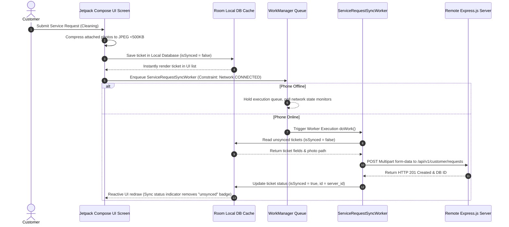

# Workflows & Data Flows - SWAYOG Customer Mobile App

## 1. App Launch & Telemetry Loading Flow
This workflow describes how the app boots, instantly loads cached telemetry from Room database to present a fast UI, and issues background network calls to update the cache.

```mermaid
sequenceDiagram
    autonumber
    actor Customer
    participant App as Jetpack Compose App
    participant LocalDB as Room Local SQLite
    participant Interceptor as Auth Interceptor
    participant Backend as Express.js Backend API
    participant Growatt as Growatt ShineServer API

    Customer->>App: Launch Application
    App->>LocalDB: Read cached Profile & Session details
    LocalDB-->>App: Return Profile (User ID: 105)
    App->>App: Display Cached Metrics immediately

    rect rgb(25, 30, 45)
        Note over App, Backend: Sync telemetry details in background
        App->>Interceptor: Request GET /inverter-generation
        Interceptor->>Interceptor: Inject Bearer <accessToken>
        Interceptor->>Backend: Forward Authorized Request
        alt Token Expired (401 Unauthorized Response)
            Backend-->>Interceptor: Return HTTP 401 Unauthorized
            Interceptor->>Interceptor: Intercept & Pause active pipelines
            Interceptor->>Backend: POST /auth/refresh with refreshToken
            Backend-->>Interceptor: Return New JWT access token
            Interceptor->>App: Update Session tokens in EncryptedPrefs
            Interceptor->>Backend: Retry original GET /inverter-generation with new Token
        end
        Backend->>Growatt: Request live solar register readings
        Growatt-->>Backend: Return power (kW) & yield (kWh) DTO
        Backend-->>App: HTTP 200 Return generation telemetry
    end

    App->>LocalDB: Update InverterGenerationSummaryEntity
    LocalDB-->>App: Reactive StateFlow trigger UI update
    App->>Customer: Render updated telemetry & Online badge
```

---

## 2. Offline Writing & Background Reconcile Flow
This diagram details the write-queue process that guarantees service ticket submissions are reconciled with backend nodes even when starting offline.

