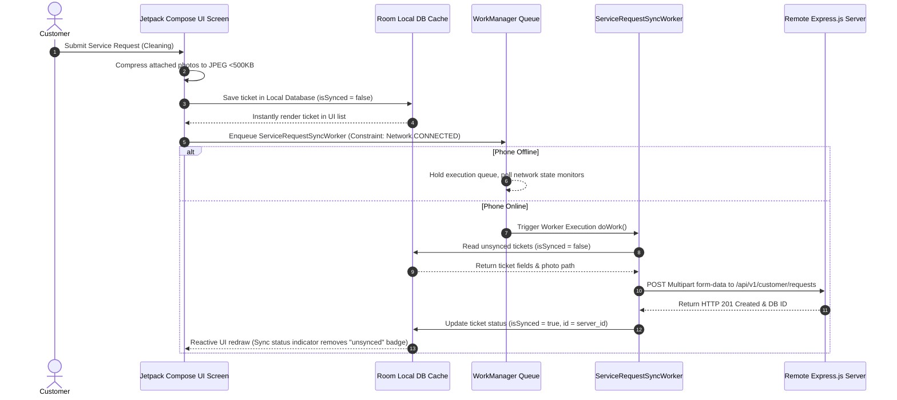

# SWAYOG Customer Mobile App: Comprehensive Specifications Document

This document compiles the **Business Requirement Document (BRD)**, **Product Requirement Document (PRD)**, **Wireframe and UI/UX Mock Up**, **Privacy Policies**, **API Documentation**, **Workflows**, and **Terms and Conditions** for the SWAYOG Customer Mobile Application.

---

## 1. Business Requirement Document (BRD)

### 1.1 Executive Summary & Opportunity
Solar energy customers face a visibility gap after installing physical solar systems. Customers require access to real-time telemetry data, payment ledger schedules, material delivery statuses, and ongoing service support.
The **SWAYOG Customer Mobile App** is a native Android portal designed to solve these issues. It bridges the gap between hardware installation and consumer visibility, boosting customer retention and reducing administrative overhead by automating service tickets and ledger payments.

### 1.2 Target Audience
* **Residential Customers**: Private homeowners monitoring rooftop panels.
* **Commercial & Industrial (C&I) Clients**: Small to medium businesses checking daily generation outputs, system efficiency, and service schedules.

### 1.3 Key Business Goals
* **Automate AMC Cleanings & Tickets**: Lower support call volume by 45% by shifting service requests to in-app self-service booking.
* **Streamline Collections**: Reduce invoice reconciliation lag from 14 days to real-time via Razorpay SDK integration.
* **Improve Post-Sales Engagement**: Boost customer trust by displaying live inverter analytics, environmental impact logs, and local weather forecasts.

### 1.4 Key Performance Indicators (KPIs)
* **Daily Active Users (DAU)**: Monitoring daily generation metrics.
* **Self-Service Ratio**: Service requests logged in-app vs phone requests.
* **Invoice Turnaround Time**: Time taken to clear outstanding balance.
* **Offline Synchronization Success**: Successful syncing of service tickets created offline.

---

## 2. Product Requirement Document (PRD)

### 2.1 Scope & Feature Breakdown

#### A. Multi-Period Inverter Telemetry Graph (Analytics)
* **Real-time**: Displays a spline (Bezier) path showing active kW power generation curves across hours.
* **Weekly**: Aggregates the daily generation values (kWh) for the last 7 days using rounded vertical bar charts.
* **Monthly**: Renders daily kWh values for the current month.
* **Yearly**: Renders monthly cumulative kWh values.
* **Interactive Tooltip**: Displays precise timestamped power yields on user touch/drag gesture.

#### B. Dynamic Local Weather Widget
* Fetches the customer's location (city) from their profile.
* Query the Open-Meteo free API to display current temperature (°C), sky conditions (Sunny, Cloudy, Rainy, etc.), and wind speed (km/h) to show current weather parameters affecting solar generation.

#### C. Edge-to-Edge Premium Dark Styling
* First-impression dark mode UI leveraging the solar-themed color scheme (`#0B132B` deep background, `#FF6B00` brand orange, `#10B981` eco green, and `#0284C7` info blue).
* Transparent top bars and clean card layouts.

#### D. Secure Biometric Session Handshake
* Fingerprint authentication interface fallback to secure database checks via Android KeyStore.
* Automatic session locking if the app is inactive for more than 15 minutes.

#### E. Service Desk & Offline Sync Queue
* Category dropdown menus, description fields, geo-location tagging, and image compression compression logic (below 500KB JPEG).
* WorkManager scheduling ensures offline request submissions sync with the PostgreSQL DB once internet connection returns.

#### F. Payments & Ledgers
* Embedded Razorpay Android Standard Integration SDK, outstanding invoices ledger lists, and webhooks verification checkups.

### 2.2 Non-Functional Requirements (NFR)
* **Performance**: GPU-accelerated logo animations run at a lock-smooth 60fps on the GPU draw-phase by bypassing Jetpack Compose recomposition loop constraints.
* **API Security**: Token-based JSON authentication with silent automated JWT access updates (15m Access Token TTL, 7d Refresh Token TTL).
* **Offline Caching**: Room local database cache serves as the single source of truth for the UI.

### 2.3 Edge Cases & Error Handling
* **Stale Token on Submission**: If an access token expires while submitting a service request, the HTTP Auth Interceptor blocks the pipeline, requests a new access token, and retries the upload seamlessly.
* **No Network Connection**: Display a clean diagnostic banner instead of generic error codes.
* **Keystore Corruption Fallback**: If EncryptedSharedPreferences fail to initialize due to device hardware issues, fall back to standard encrypted SharedPreferences.

---

## 3. Wireframe & UI/UX Mock Up

### 3.1 Login Screen Wireframe
```
+-------------------------------------------------------+
|  Status Bar (Dark)                                    |
+-------------------------------------------------------+
|                                                       |
|                     [ SWAYOG LOGO ]                   |
|                  (Rotating Sun Vector)                |
|                                                       |
|                  Welcome to SWAYOG                    |
|                                                       |
|        +-------------------------------------+        |
|        | Login ID / Email                    |        |
|        +-------------------------------------+        |
|        | Password                        [o] |        |
|        +-------------------------------------+        |
|                                                       |
|        [x] Remember Me                                |
|                                                       |
|        +-------------------------------------+        |
|        |               LOGIN                 |        |
|        +-------------------------------------+        |
|                                                       |
|                    [ Fingerprint ]                    |
|                Tap to Quick Authenticate              |
|                                                       |
+-------------------------------------------------------+
```

### 3.2 Dashboard Screen Wireframe
```
+-------------------------------------------------------+
| Good Morning ☀️                            [LOGOUT]   |
| Harshal Tapre                                         |
+-------------------------------------------------------+
|                                                       |
|  +-------------------------------------------------+  |
|  | Installation Journey                            |  |
|  | Step 5 of 12 (41%)                   [ TRACK ]  |  |
|  +-------------------------------------------------+  |
|                                                       |
|  +-------------------------------------------------+  |
|  |             Live Energy Generation              |  |
|  |                    (  1.8  )                    |  |
|  |                       kW                        |  |
|  |              [Peak Cap: 5.4 kW]                  |  |
|  +-------------------------------------------------+  |
|                                                       |
|  +------------------+ +------------------+ +-------+  |
|  | Daily Output     | | Lifetime         | | Sync  |  |
|  | 12.4 kWh         | | 3,420 kWh        | | Online|  |
|  +------------------+ +------------------+ +-------+  |
|                                                       |
|  +-------------------------------------------------+  |
|  | Local Solar Weather: Pune                       |  |
|  | Partly Cloudy 🌤️    29°C    💨 12 km/h           |  |
|  +-------------------------------------------------+  |
|                                                       |
|  +-------------------+ +---------------------------+  |
|  | [Home]  [Tracker] | | [Service] [Pay] [Settings]|  |
|  +-------------------+ +---------------------------+  |
+-------------------------------------------------------+
```

### 3.3 Telemetry / Analytics Screen Wireframe
```
+-------------------------------------------------------+
| [<-]               Energy Analytics                   |
+-------------------------------------------------------+
|                                                       |
|  +-------------------------------------------------+  |
|  | [Real-time]  | [Weekly] |  [Monthly]  | [Yearly]|  |
|  +-------------------------------------------------+  |
|                                                       |
|  Timeframe: Wed, 12 Jun  •  Output: 4.2 kWh           |
|                                                       |
|  +-------------------------------------------------+  |
|  |  *                                              |  |
|  |  |  *                                           |  |
|  |  |  |  *           *                            |  |
|  |  |  |  |  *        |  *                         |  |
|  |  |  |  |  |  *  *  |  |                         |  |
|  |  |  |  |  |  |  |  |  |                         |  |
|  |--+--+--+--+--+--+--+--+-------------------------|  |
|  +-------------------------------------------------+  |
|                                                       |
|  Telemetry Summary                                    |
|  +------------------+ +------------------+ +-------+  |
|  | Today's Yield    | | Peak Output      | | Source|  |
|  | 14.2 kWh         | | 5.2 kW           | | Cloud |  |
|  +------------------+ +------------------+ +-------+  |
+-------------------------------------------------------+
```

---

## 4. Privacy Policies

### 4.1 Data Minimization & Security
We collect and encrypt:
* **User Profile Data**: Full name, contact phone, and installation address cache.
* **Credentials**: Kept inside Android's secure `EncryptedSharedPreferences` sandbox and authenticated via the server.
* **Telemetry Details**: Generation logs, inverter brand settings, and system size parameters.
* **Image Uploads**: Compresses attachments locally under 500KB before transmission and purges local storage cache post-upload.

### 4.2 Device Permissions & Location Privacy
* **Geo-location Access**: Access to latitude and longitude is requested *only* during the service ticket logging phase to attach correct coordinates. Location checks are turned off immediately once the ticket is successfully generated.
* **Camera / Storage Access**: Standard camera and photo library access triggers explicitly when attaching images to service tickets. No background image scans are performed.

---

## 5. API Documentation

### 5.1 Authentication Contracts

#### A. Customer Login (`POST /api/v1/auth/login`)
* **Headers**: `Content-Type: application/json`
* **Request Payload**:
```json
{
  "loginId": "customer123",
  "password": "SecurePassword123"
}
```
* **Response Payload (Success - 200 OK)**:
```json
{
  "status": "success",
  "data": {
    "accessToken": "eyJhbGciOiJIUzI1NiIsInR5cCI6IkpXVCJ9...",
    "refreshToken": "48ca83d5-e9df-41a4-9b2b-9be24a3501fe"
  }
}
```

#### B. Token Refresh Handshake (`POST /api/v1/auth/refresh`)
* **Headers**: `Content-Type: application/json`
* **Request Payload**:
```json
{
  "refreshToken": "48ca83d5-e9df-41a4-9b2b-9be24a3501fe"
}
```
* **Response Payload (Success - 200 OK)**:
```json
{
  "status": "success",
  "data": {
    "accessToken": "eyJhbGciOiJIUzI1NiIsInR5cCI6IkpXVCJ9...",
    "refreshToken": "a3b98c21-12df-4223-bd21-1fe231bc90a1"
  }
}
```

### 5.2 Inverter Data & Telemetry Contracts

#### A. Current System Generation Telemetry (`GET /api/v1/subadmin/customers/{customerId}/inverter-generation`)
* **Headers**: `Authorization: Bearer <accessToken>`
* **Response Payload (Success - 200 OK)**:
```json
{
  "dailyGeneration": 12.45,
  "totalGeneration": 3450.8,
  "peakPower": 5.4,
  "currentPower": 2.1,
  "isSimulated": false,
  "status": "online",
  "lastUpdated": "2026-06-15T11:43:00Z"
}
```

#### B. Historical System Performance Data (`GET /api/v1/subadmin/customers/{customerId}/inverter-generation-history`)
* **Headers**: `Authorization: Bearer <accessToken>`
* **Parameters**: `?period=realtime` | `?period=daily` | `?period=yearly`
* **Response Payload (Success - 200 OK)**:
```json
{
  "customerId": 105,
  "period": "daily",
  "history": [
    { "label": "09 Jun", "power": null, "generation": 14.2 },
    { "label": "10 Jun", "power": null, "generation": 15.1 },
    { "label": "11 Jun", "power": null, "generation": 13.8 },
    { "label": "12 Jun", "power": null, "generation": 14.5 },
    { "label": "13 Jun", "power": null, "generation": 16.2 },
    { "label": "14 Jun", "power": null, "generation": 12.1 },
    { "label": "15 Jun", "power": null, "generation": 11.9 }
  ]
}
```

### 5.3 Service request Contracts

#### A. Submit Service request Ticket (`POST /api/v1/customer/requests`)
* **Headers**: `Authorization: Bearer <accessToken>`, `Content-Type: multipart/form-data`
* **Multipart Fields**:
  * `serviceType`: String (e.g., "Panel Cleaning")
  * `description`: String
  * `address`: String
  * `latitude`: Double
  * `longitude`: Double
  * `preferredDate`: String (Format: `yyyy-MM-dd`)
  * `images`: Binary File (Optional attachment)
* **Response Payload (Success - 201 Created)**:
```json
{
  "status": "success",
  "data": {
    "id": 982,
    "serviceType": "Panel Cleaning",
    "status": "pending",
    "createdAt": "2026-06-15T11:44:00Z"
  }
}
```

---

## 6. Workflows

### 6.1 Session Resume and Inverter Telemetry Fetch Flow
This diagram details the startup sequence of the mobile application checking sessions, obtaining new auth tokens silently on failure, and populating local caches.

```mermaid
sequenceDiagram
    autonumber
    actor Customer
    participant App as Jetpack Compose App
    participant LocalDB as Room Local SQLite
    participant Interceptor as Auth Interceptor
    participant Backend as Express.js Backend API
    participant Growatt as Growatt ShineServer API

    Customer->>App: Launch Application
    App->>LocalDB: Read cached Profile & Session details
    LocalDB-->>App: Return Profile (User ID: 105)
    App->>App: Display Cached Metrics immediately

    rect rgb(25, 30, 45)
        Note over App, Backend: Sync telemetry details in background
        App->>Interceptor: Request GET /inverter-generation
        Interceptor->>Interceptor: Inject Bearer <accessToken>
        Interceptor->>Backend: Forward Authorized Request
        alt Token Expired (401 Unauthorized Response)
            Backend-->>Interceptor: Return HTTP 401 Unauthorized
            Interceptor->>Interceptor: Intercept & Pause active pipelines
            Interceptor->>Backend: POST /auth/refresh with refreshToken
            Backend-->>Interceptor: Return New JWT access token
            Interceptor->>App: Update Session tokens in EncryptedPrefs
            Interceptor->>Backend: Retry original GET /inverter-generation with new Token
        end
        Backend->>Growatt: Request live solar register readings
        Growatt-->>Backend: Return power (kW) & yield (kWh) DTO
        Backend-->>App: HTTP 200 Return generation telemetry
    end

    App->>LocalDB: Update InverterGenerationSummaryEntity
    LocalDB-->>App: Reactive StateFlow trigger UI update
    App->>Customer: Render updated telemetry & Online badge
```



### 6.2 Offline Write & Sync Flow
This diagram details the write-queue process that guarantees service ticket submissions are reconciled with backend nodes even when starting offline.



---

## 7. Terms and Conditions

### 7.1 Scope of App Usage
* **Eligible Users**: The SWAYOG Customer Mobile App is licensed exclusively to verified active clients who have purchased and installed solar array setups with SWAYOG or authorized project partners.
* **Accuracy of Telemetry**: Telemetry readings (power generated, lifetime values, active status) are mapped from physical telemetry hardware registers (Growatt, Solis, or hybrid inverters). Actual generation yields might vary slightly due to device sync intervals, cloud platform outages, or local network dropouts.

### 7.2 Service Booking and AMC SLA
* **Cleaning Scheduling**: Maintenance and panel cleaning requests submitted through the service portal require a minimum booking window of **48 hours**. Emergency repair tickets are triaged based on severity guidelines.
* **Geo-Location Validity**: The customer agrees to provide correct location permissions to the application during service logging. Submission of false location data to override AMC range verification is grounds for ticket suspension.

### 7.3 Billing & Razorpay Payments
* **Payment Processing**: Payment operations are executed securely via Razorpay payment APIs. SWAYOG does not store physical card credentials or netbanking login data on domestic servers.
* **Refund Policy**: AMC fees and system balances paid via Razorpay are subject to SWAYOG’s main contract guidelines. In the event of a double charge, the user will be refunded within 5-7 business days.
